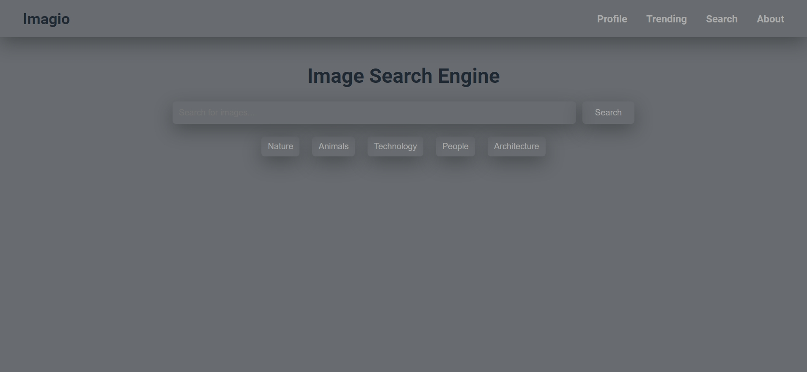

# Imagio - Image Search Engine

Imagio is an image search engine that allows users to search for various types of images across different categories such as Nature, Animals, Technology, People, and Architecture. The project is designed with HTML, CSS, and JavaScript to provide a user-friendly interface for seamless image searching.
## Live Demo
 Live View - [Visit Imagio Website](https://get-unknown-err0r.github.io/imagio-img-search-engine/ "Check out the Imagio repository")
## Output 



## Features

- **Search Functionality**: Users can search for images using keywords.
- **Category Filters**: Choose from different image categories: Nature, Animals, Technology, People, and Architecture.
- **Pagination**: Navigate through multiple pages of search results.
- **Responsive Navbar**: A responsive navigation bar with a hamburger menu for smaller screen sizes.
- **Download Button**: Option to download images.

## Installation

1. Clone the repository:
   ```bash
   git clone https://github.com/GET-UNKNOWN-ERR0R/imagio-img-search-engine.git
   ```
 ## License -  
 This project is open-source and available under the MIT License.
